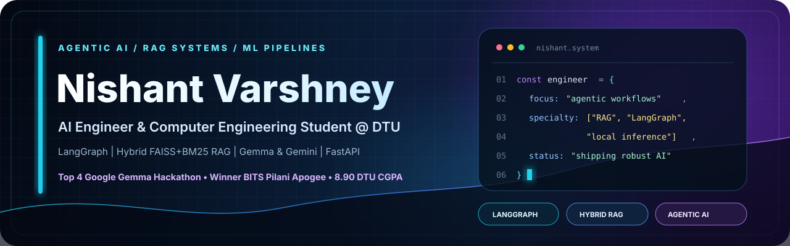
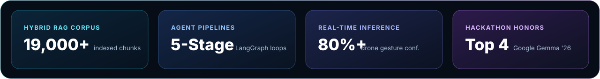
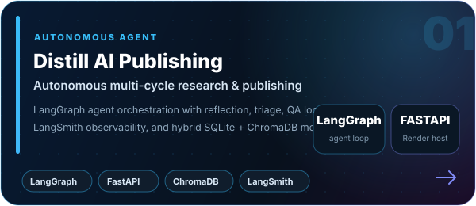
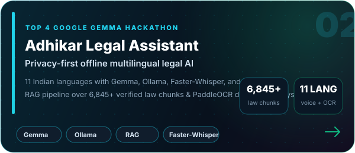
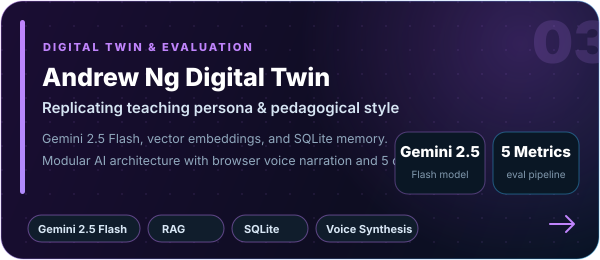
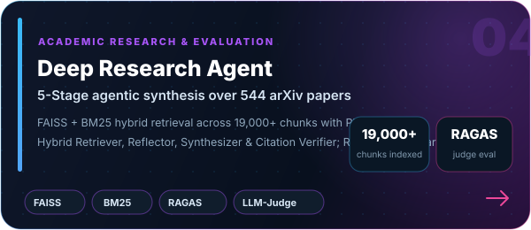
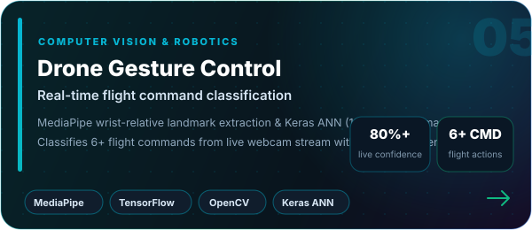
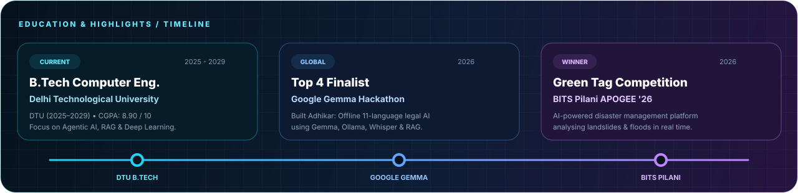
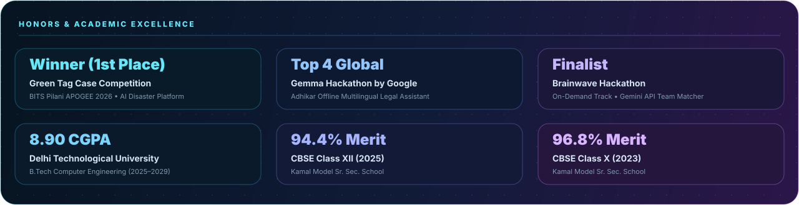

  

  
  
  
  

  

<h2 align="center">About</h2>

  B.Tech student in <strong>Computer Engineering</strong> at <strong>Delhi Technological University (DTU)</strong> with an <strong>8.90 CGPA</strong>. 
  Winner at <strong>BITS Pilani APOGEE 2026</strong> and Top 4 globally at <strong>Google Gemma Hackathon</strong>.

  I design and architect <strong>autonomous Agentic AI workflows</strong>, <strong>hybrid RAG pipelines</strong>, and <strong>privacy-first offline AI systems</strong>. 
  My focus is on grounded reasoning, citation verification, reproducible evaluations, and production-ready deployments.

  
  
  

<h2 align="center">Featured Systems</h2>

  
  

  
  

  

  

<strong>Project architecture, benchmarks, and deep dives</strong>

- **Distill — Autonomous AI Publishing Agent:** Multi-stage LangGraph agent automating research discovery, deterministic triage, editorial evaluation, reflection, and QA/revision loops. Deployed on Render with FastAPI, LangSmith observability, async per-agent scheduling, and hybrid SQLite + ChromaDB memory with BM25 + SentenceTransformers.
- **Adhikar — Offline Multilingual Legal Assistant (Top 4 Google Gemma Hackathon):** Privacy-first 100% on-device legal assistant supporting 11 Indian languages across text, voice, and document analysis. Powered by Gemma, Ollama, Faster-Whisper, PaddleOCR, and MMS-TTS over 6,845+ verified legal knowledge chunks with citation verification and automated draft generation.
- **Andrew Ng Digital Twin:** Conversational pedagogical agent replicating Andrew Ng's teaching philosophy and tone. Powered by Gemini 2.5 Flash, RAG, vector embeddings, and SQLite memory with modular browser-based voice narration and a 5-metric evaluation pipeline.
- **Deep Research Agent:** 5-stage agentic research assistant (Planner, Hybrid Retriever, Reflector, Synthesizer, Citation Verifier) spanning 544 LLM-agent arXiv papers and 19,000+ document chunks via FAISS + BM25 hybrid retrieval. Rigorously benchmarked with RAGAS and LLM-as-a-Judge metrics across 6 configurations.
- **Drone Gesture Control:** Real-time gesture classification system using MediaPipe wrist-relative landmark extraction and a TensorFlow/Keras ANN (128→64→Softmax) classifying 6+ flight commands from live webcam feeds with 80%+ real-time prediction confidence.

<h2 align="center">Timeline &amp; Milestones</h2>

  

<h2 align="center">Technical Stack</h2>

  

  <code>LangGraph</code>&nbsp;
  <code>LangChain</code>&nbsp;
  <code>Agentic AI</code>&nbsp;
  <code>Hybrid RAG</code>&nbsp;
  <code>FAISS</code>&nbsp;
  <code>ChromaDB</code>&nbsp;
  <code>BM25</code>&nbsp;
  <code>RAGAS</code>&nbsp;
  <code>LangSmith</code>&nbsp;
  <code>Gemini API</code>&nbsp;
  <code>Gemma &amp; Ollama</code>&nbsp;
  <code>MediaPipe</code>&nbsp;
  <code>Faster-Whisper</code>&nbsp;
  <code>PaddleOCR</code>

<h2 align="center">GitHub Activity</h2>

  

  

<h2 align="center">Selected Achievements</h2>

  

<strong>Selected certifications &amp; credentials</strong>

- **Deep Learning Specialization** — DeepLearning.AI
- **Machine Learning Specialization** — DeepLearning.AI

 

  

  

